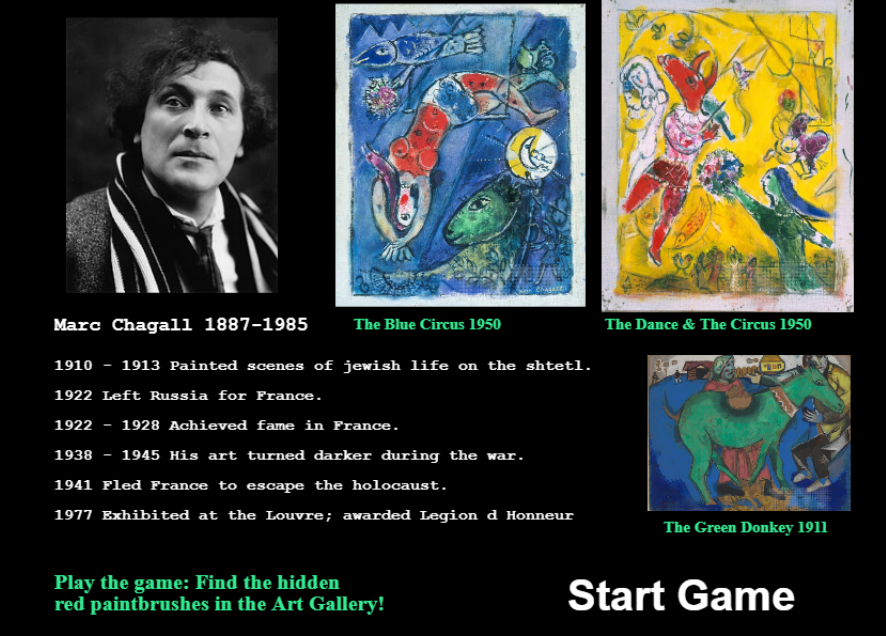
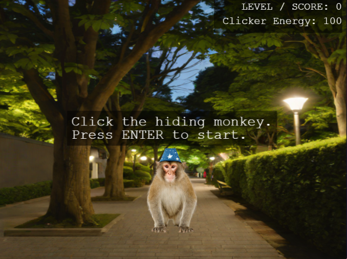
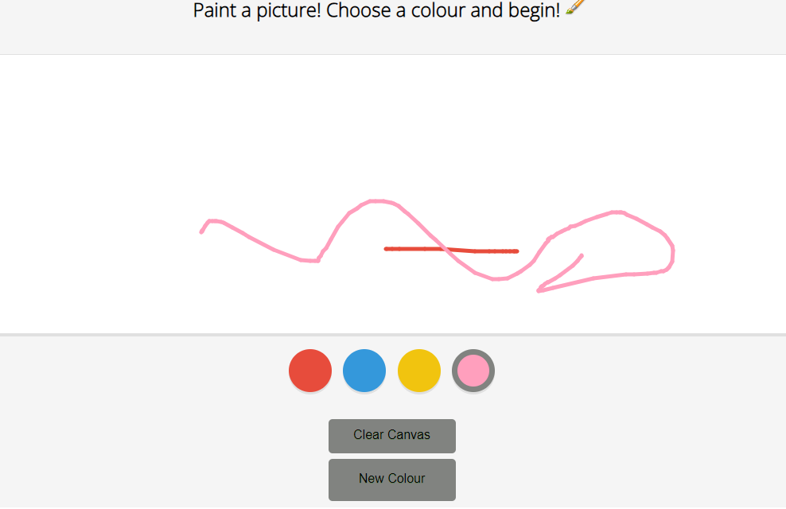

# Marc Chagall Gallery & Painting Game
Aimed at ages 18-25, the 1-2 minute game offers a quick look into the life of a  refugee artist. It is a short game to learn about the artist, refugee Marc Chagall, play a short game of finding the paintbrush in the Art Gallery and then paint a picture.
## Link to deployed page: 
https://vickysug.github.io/marc-chagall-gallery-game/

## Game mission:
Find the hiding red paintbrushes in the decorative plants in the art gallery. The paintbrushes fade as the game progresses. After collecting as many as possible, move onto the next challenge and paint a picture. 
## Link to my storyborad on Canva: 
https://www.canva.com/design/DAGIxuuOe1c/gAGLIfoLcIclMaqB9cJxEQ/edit?utm_content=DAGIxuuOe1c&utm_campaign=designshare&utm_medium=link2&utm_source=sharebutton

## Project Brief

This project was one of several small projects during my internship with BIZGEES. The brief:

* Select a celebrity who was a refugee.

* Compile the information and background.

* Create a short 30 second - 2 minute game aimed at age group 18 -25.

* The game is to allow the player to learn about the refugee.

* Use AI to aid the creation.

I chose the artist Marc Chagall.

## Technologies used

For the project the aim was to use AI, mainly Rosebud AI (https://play.rosebud.ai/home)

On the platform a developer can clone games created by other developers and change them for their own purpose. 

I chose to use a game called Find the magic monkey, Evolved from: 2D Playground
Created by: radio_biscuit.

https://play.rosebud.ai/games/43fe3de4-746b-4522-8c1e-ca7b25809921

Although Rosebud can generate AI images, I found mine in a free image app and from images I had taken. 
Rosebud also allows the AI chat to change code.

For the painting scene game I created this in VS code and added it to the game.  

https://vickysug.github.io/colouring-game/